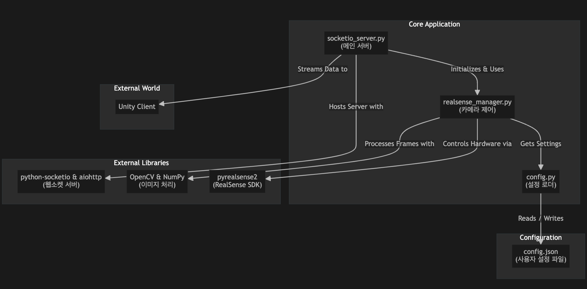

# RSUnityLink-python

RealSense D435i 카메라의 영상 및 센서 데이터를 Python 서버를 통해 Unity로 실시간 스트리밍하는 프로젝트입니다.

## 작동 영상

[](https://youtu.be/MU2hgVjgmp0)

*위 이미지를 클릭하면 작동 영상을 볼 수 있습니다.*

## 주요 기능

*   **실시간 스트리밍**: RealSense 카메라의 Color, Depth 데이터를 Unity로 전송합니다.
*   **Socket.IO 통신**: 안정적인 웹소켓 통신을 위해 `python-socketio`를 사용합니다.
*   **설정 파일**: `config.json`을 통해 스트림(Color, Depth, IMU) 활성화 여부, 해상도, FPS를 쉽게 변경할 수 있습니다.

## 아키텍처 다이어그램



## 현재 아키텍처

*   **Python 서버 (`socketio_server.py`)**:
    *   `realsense_manager.py`: RealSense 카메라 하드웨어를 제어하고 데이터 프레임을 가져옵니다.
    *   `config.py`: `config.json` 파일에서 설정을 읽어 카메라와 서버 동작을 관리합니다.
    *   Socket.IO 서버를 구동하여 Unity 클라이언트의 연결을 기다리고, 요청 시 데이터를 스트리밍합니다.

*   **Unity 클라이언트 (`unitySocketProject/`)**:
    *   `WebSocketTest.cs`: Socket.IO 클라이언트를 사용하여 서버에 접속하고, `frame_data` 이벤트를 통해 수신한 데이터를 화면 UI에 렌더링합니다.

## 설치 및 실행 방법

### 1. Python 서버 설정

**의존성 설치:**
프로젝트 루트 디렉토리에서 아래 명령어를 실행하여 필요한 Python 라이브러리를 설치합니다.

```bash
pip install -r requirements.txt
```

**서버 실행:**

```bash
python3 socketio_server.py
```

*   서버를 처음 실행하면, 기본 설정이 담긴 `config.json` 파일이 자동으로 생성됩니다.
*   이후 `config.json` 파일을 수정하여 원하는 스트림 조합, 해상도, FPS를 설정할 수 있습니다. (서버 재시작 필요)

### 2. Unity 클라이언트 설정

1.  Unity Hub에서 `unitySocketProject` 폴더를 프로젝트로 엽니다.
2.  `Assets/Scenes/SampleScene` 씬을 엽니다.
3.  `Canvas` 오브젝트 아래에 있는 `WebSocketManager` 게임 오브젝트를 선택합니다.
4.  Inspector 창의 **WebSocket Test** 컴포넌트에서 `Server Url` 필드에 Python 서버가 실행 중인 장치(라즈베리파이 등)의 IP 주소를 입력합니다. (예: `http://192.168.0.10:8080`)
5.  Unity 에디터에서 플레이 버튼을 눌러 실행합니다.
6.  "Start Streaming" 버튼을 클릭하여 서버로부터 데이터 수신을 시작합니다.

## 보관된 파일

이전 버전의 테스트 스크립트 및 레거시 파일들은 `_archive` 폴더에 보관되어 있습니다.